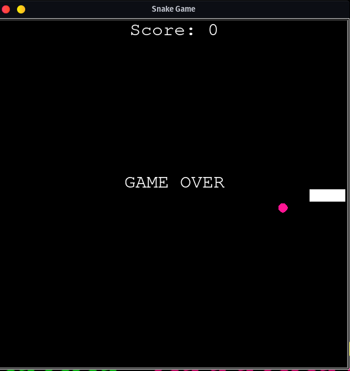

# Python Snake Game

This is a simple and classic Snake game implemented in Python using the Turtle graphics module. The player controls a snake to move around the screen, eat food, and avoid collisions with the walls and its own tail.


## Table of Contents

- [Installation](#installation)
- [How to Play](#how-to-play)
- [Game Components](#game-components)
- [License](#license)

## Installation

To play the game, you need Python 3.x installed on your system. To check if you have Python 3.x installed, run the following command in your terminal:

```bash
python3 --version
```

If Python 3.x is not installed, follow the instructions on the [official Python website](https://www.python.org/downloads/) to download and install it.

Next, clone this repository to your local machine:

```bash
git clone https://github.com/yourusername/python-snake-game.git
```

Navigate to the project folder:

```bash
cd python-snake-game
```

Run the game:

```bash
python3 main.py
```

## How to Play

Use the arrow keys on your keyboard to control the snake:

- Up Arrow: Move the snake up
- Down Arrow: Move the snake down
- Left Arrow: Move the snake left
- Right Arrow: Move the snake right

The goal is to eat the food that appears on the screen. Each time the snake eats food, it grows longer and your score increases. The game ends when the snake collides with the walls or its own tail.

## Game Components

The game consists of the following components:

1. **main.py**: The main game file that sets up the screen, snake, food, and scoreboard, and runs the game loop.
2. **snake.py**: Contains the `Snake` class that defines the snake's behavior, such as moving and extending its body.
3. **food.py**: Contains the `Food` class that defines the behavior of the food, such as appearing at random locations on the screen.
4. **scoreboard.py**: Contains the `Scoreboard` class that manages the player's score and displays the game over message.

## License

This project is licensed under the [MIT License](LICENSE).